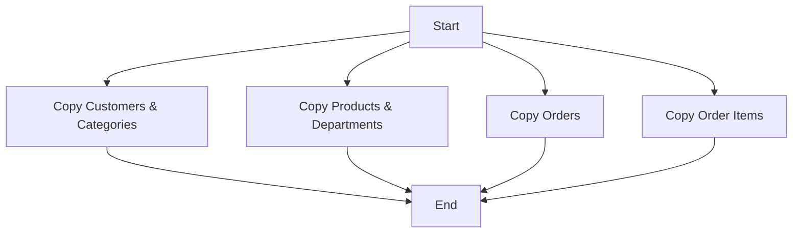

# Data Pipeline with Airflow & Docker

A scalable ETL pipeline for copying data from a source database to a target database using Apache Airflow and Docker, with parallel processing capabilities.

## 📦 Project Structure

```
.
├── dags/                           # Airflow DAG definitions
│   └── data_pipeline.py            # Main pipeline DAG
├── src/                            # ETL application code
│   ├── app.py                      # Main application entry point
│   ├── config.py                   # Database configuration loader
│   ├── process.py                  # Data processing utilities
│   ├── read.py                     # Source database reading operations
│   └── write.py                    # Target database writing operations
    ├── tables_list                     # List of tables to process
    ├── Dockerfile                      # Data pipeline image definition
    ├── requirements.txt                # Python dependencies
```

## 🚀 Features

- **Parallel Data Processing**: Split table processing across multiple Docker containers
- **Database Agnostic**: Supports MySQL (source) and PostgreSQL (target) 
- **Airflow Integration**: Managed workflow scheduling and monitoring
- **Dockerized**: Containerized execution for reproducibility
- **Error Handling**: Data validation and duplicate key management

## ⚙️ Technologies

- Apache Airflow
- Docker
- PostgreSQL
- MySQL
- Python 3.10+

## 🛠️ Installation

### Prerequisites
- Docker & Docker Compose
- Apache Airflow (via Docker recommended)
- Python 3.10+

```bash
# Install Python dependencies
pip install -r requirements.txt
```

## 🏃♀️ Getting Started

### 1. Database Setup
Create source (MySQL) and target (PostgreSQL) databases with matching schemas.

### 2. Build Data Pipeline Image
```bash
docker build -t data-pipeline:latest .
```

### 3. Create Docker Network
```bash
docker network create my_pipeline_network
```

### 4. Configure Airflow
```yaml
# docker-compose.yml (partial)
services:
  airflow-webserver:
    volumes:
      - ./dags:/opt/airflow/dags
      - /var/run/docker.sock:/var/run/docker.sock
    networks:
      - my_pipeline_network
```

### 5. Run Airflow Services
```bash
docker-compose up -d
```

## 📊 Pipeline Execution

### Trigger DAG
1. Access Airflow UI at `http://localhost:8080`
2. Enable and trigger `data-pipeline-parallel` DAG

### Expected Flow


## 🔧 Configuration

### Environment Variables
```python
# In DAG definition
env_vars = {
    'SOURCE_DB_USER': 'retail_user',
    'SOURCE_DB_PASS': 'itversity',
    'TARGET_DB_USER': 'retail_user',
    'TARGET_DB_PASS': 'itversity'
}
```

### Table Configuration
Update `tables_list` with your source database tables:
```
customers
orders
order_items
products
categories
departments
```

## 🧠 Customization

### Parallel Processing
Adjust task groups in `data_pipeline.py`:
```python
table_groups = [
    {'task_id': 'copy_customers_categories', 'tables': ['customers', 'categories']},
    {'task_id': 'copy_products_departments', 'tables': ['products', 'departments']},
    {'task_id': 'copy_orders', 'tables': ['orders']},
    {'task_id': 'copy_order_items', 'tables': ['order_items']}
]
```

### Scheduling
Modify DAG schedule interval:
```python
dag = DAG(
    ...
    schedule_interval='0 0 * * *',  # Daily at midnight
    ...
)
```

## 🚨 Troubleshooting

Common Issues:
1. **Docker Permission Denied**
   ```bash
   sudo usermod -aG docker $USER
   newgrp docker
   ```

2. **Database Connection Issues**
   - Verify network configuration
   - Check firewall rules
   - Validate credentials

3. **Duplicate Key Errors**
   ```postgres
   TRUNCATE TABLE 
      order_items,
      orders,
      products,
      categories,
      departments,
      customers
    RESTART IDENTITY CASCADE;
   ```

4. **Airflow UI Not Updating**
   ```bash
   airflow db reset
   airflow webserver --restart
   ```

## 📄 License

MIT License - See [LICENSE](LICENSE) for details

## 📧 Contact

[Waithaka Francis] - [waithakaf483@gmail.com]
